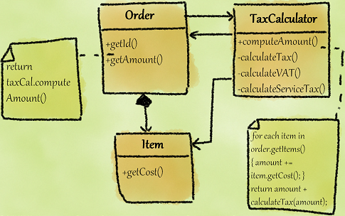

# Cyclically-dependent Modularization

<div class="video-wrapper">
<iframe width="560" height="315" src="https://www.youtube.com/embed/Xm5T75YZB0I" title="YouTube video player" frameborder="0" allow="accelerometer; autoplay; clipboard-write; encrypted-media; gyroscope; picture-in-picture" allowfullscreen></iframe>
</div>


Smell ini terjadi ketika dua atau lebih abstraction saling bergantung satu sama lain baik secara langsung maupun tidak langsung. Smell ini tentunya melanggar [Acyclic Dependencies Principle (ADP)](https://en.wikipedia.org/wiki/Acyclic_dependencies_principle).

Smell ini tidak hanya terjadi secara langsung secara inheritence dan field member, namun juga secara tidak langsung secara variabel dalam method maupun secara parametrik. Dampak dari smell ini adalah keharusan sang developer untuk menjalankan, tes, dan modifikasi pasangan cyclic class secara bersamaan, yang bahayanya dapat berpotensi terjadinya *domino-effect* karena harus merubah class yang cyclic secara bersamaan atau dalam kasus fatalnya, bisa menjadi "senjata makan tuan" dari class pemanggil methodnya sendiri.

## Penyebab

- **Improper responsibility realization**: Adanya salah penempatan member abstraksi di abstraksi lain.
- **Passing a self reference**: Adanya passing dengan penggunaan `this` (reference dirinya) ketika melakukan passing referensi ke method dari abstraksi lain.
- **Implementing call-back functionality**: Adanya pemakaian call-back menimbulkan adanya dependensi cyclic antar class yang tidak diduga.
- **Hard-to-visualize indirect dependencies**: Dalam beberapa software kompleks, cukup sulit bagi developer untuk visualisasikan hubungan dependensi antar abstraksi sehingga menimbulkan perputaran dependensi antar abstraksi/class.

## Contoh

## Contoh 1: `java.util` inter-abstractions cyclic interdepedency


Dalam buku yang ditulis oleh Girish, Girish menyinggung package `java.util` yang berisikan 6 abstractions yang sangat kompleks dan sangat cyclic ketergantungan antar classnya. Class tersebut hampir semuanya saling bergantung satu sama lain.

Secara mendasar, Girish juga menuliskan catatan mengenai adanya potensi *domino-effect* karena adanya perubahan antar class ketika terdapat perubahan dalam satu abstraksi yang secara eksplisit dikutipkan sebagai berikut (hal 108-109, Chapter 5):

> In this design, any change to an abstraction involved in this dependency chain has the potential to affect other abstractions that depend on it, causing **ripple effects or cascade of changes**. A designer must, therefore, strive for designs that do not consist of tangles.

Meski secara hierarki cukup sulit dalam memberantas adanya smell pada tingkat tinggi, apalagi pada level programming language API, namun kasus ini bisa dicegah dari bibit-bibitnya pada contoh kasus berikutnya.

## Contoh 2: Order and TaxCalculator



Pada kasus class <github-url to="before/Item.java">Order.java](before/Order.java), [TaxCalculator.java](before/TaxCalculator.java), dan [Item.java</github-url>, terdapat perputaran dependensi antar class. Member field class `Order` terdiri dari (composed of) beberapa `Item`, namun pada class `Order`, terdapat method `getAmount()` dimana dalam isi methodnya melakukan return `taxCal.computeAmount()`. Pada method `computeAmount()`, class tersebut mengambil semua item dalam class `Order` dan menghitung jumlah pajak dari transaksi order dengan memanggil method `calculateTax()` untuk kemudian ditotalkan dengan transaksi order tersebut dan di-return.

```java
// class Item
public double getCost() {
  return cost;
}

// class Order
public Vector<Item> getItems() {
  Vector<Item> items = new Vector<>();
  for (Item item : this.items) {
    items.add(new Item(item.getCost()));
  }
  return items;
}

public double getAmount() {
  TaxCalculator calc = new TaxCalculator();
  return calc.computeAmount(this);
}

// class TaxCalculator
public double computeAmount(Order order) {
  Vector<Item> items = order.getItems();

  double amount = 0;
  for (Item item : items) {
    amount += item.getCost();
  }

  return amount + calculateTax(amount);
}

private double calculateTax(double amount) {
  return amount * 0.1;
}
```

Secara tidak langsung, pemanggilan method `getAmount()` dari class `Order` secara tidak langsung menyebabkan adanya cyclic dependency yang menyebabkan ketergantungan yang berputar-putar. Selain itu, method dalam class ini dicurigai mempunyai smell lain yaitu [Feature Envy](../../../martin-fowler/couplers/feature_envy) dimana method ini hanya mengakses value dari class lain dan secara multidimensional, smell ini terjadi bagaikan lingkaran setan dimana terjadi *adu colong sandal* antar class sehingga rawan terjadi error karena pasangan class tersebut harus dijalankan, dites, dan diubah bersamaan.

## Penyelesaian

Untuk mencegah terjadinya cyclic depedency, ada berbagai cara untuk menyelesaikan kejadian smell ini yaitu:

- [Introduce/Extract Interface](https://refactoring.guru/extract-interface)
- Breaking cyclic by removing a Dependency
- [Introduce/Extract to another abstraction](https://refactoring.guru/extract-class)
- [Merging/Inline the abstractions](https://refactoring.guru/inline-class)

Pada kasus class `Order` dan `TaxCalculator`, diketahui bahwa terdapat method `computeAmount()` yang sebetulnya dapat ditempatkan di class `Order` sehingga class `TaxCalculator` cukup mengkalkulasikan pajak dari total transaksi keseluruhan.

```java
// class Item
public double getCost() {
  return cost;
}

// class Order
public Vector<Item> getItems() {
  Vector<Item> items = new Vector<>();
  for (Item item : this.items) {
    items.add(new Item(item.getCost()));
  }
  return items;
}

public double getAmount() {
  return computeAmount() + calc.calculateTax(amount);
}

private double computeAmount() {
  TaxCalculator calc = new TaxCalculator();
  Vector<Item> items = getItems();

  double amount = 0;
  for (Item item : items) {
    amount += item.getCost();
  }

  return amount;
}

// class TaxCalculator
private double calculateTax(double amount) {
  return amount * 0.1;
}
```

Sebagai gantinya, kita dapat memindahkan method `computeAmount()` dari class TaxCalculator ke Order sehingga class <github-url to="after/TaxCalculator.java">TaxCalculator.java](after/Order.java) tidak perlu bergantung pada [Order.java</github-url> untuk mengambil data-data dari Order dan semua kalkulasi biaya cukup dilakukan dari class `Order` dan class `TaxCalculator` cukup mengkalkulasikan berbagai jenis pajak yang akan diaplikasikan kepada total biaya dari class `Order`.

## When to Ignore

Pada kasus **Unit cycles between conceptually related abstractions**, terutama pada kasus class `java.util.regex`, terdapat 2 class yang saling bertukar peran dan saling bergantung satu sama lain yaitu class `Matcher` dan `Pattern`. Dalam kasus tersebut, kedua class memang diciptakan terpisah namun terpakai berbarengan. Meski praktik ini tepat untuk diterapkan, namun dalam beberapa kasus tertentu, terutama pada skala besar, class tetap harus dibagi untuk mencegah adanya masalah yang lebih kompleks.

## Referensi

- Paul C. Jorgensen, "Software Testing: A Craftsman's Approach, Third Edition", Bab 9, Hal 139-146. CRC Press. 2013.
- Brian Mearns, "Circular Dependencies in Dependency Injection," 11 Apr 2018. Medium. Available at https://medium.com/software-ascending/circular-dependencies-in-dependency-injection-403b790daebb
