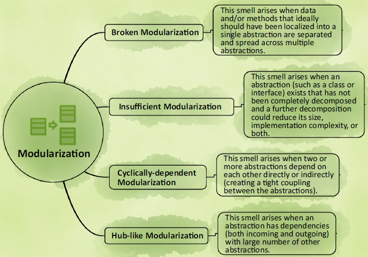

# Modularization

Semua smell di dalam grup ini berkaitan dengan kesalahan dalam merancang modul-modul di dalam hierarki.

- Modularization Intro | [Link Video](https://www.youtube.com/watch?v=Q5Y42rdZza4&list=PLG_Cu5FmqSk2KHT6lXngRvcOmOzuk4_ju)
- [Broken Modularization](broken) | [Link Video](https://www.youtube.com/watch?v=0aeIbhESMco&list=PLG_Cu5FmqSk2KHT6lXngRvcOmOzuk4_ju)
- [Insufficient Modularization](insufficient) | [Link Video](https://www.youtube.com/watch?v=eRAoks2udlk&list=PLG_Cu5FmqSk2KHT6lXngRvcOmOzuk4_ju)
- [Cyclically-dependent Modularization](cyclic) | [Link Video](https://www.youtube.com/watch?v=Xm5T75YZB0I&list=PLG_Cu5FmqSk2KHT6lXngRvcOmOzuk4_ju)
- [Hub-like Modularization](hub) | [Link Video](https://www.youtube.com/watch?v=ImUM8T-1fy4&list=PLG_Cu5FmqSk2KHT6lXngRvcOmOzuk4_ju)

### Filosofi

Buku adalah konten yang berisikan sekumpulan teks paragraf. Bayangkan apa yang terjadi bila semua teks ditulis mentah-mentah tanpa menggunakan Heading, Chapter, Bab, Indeks maupun sub-bab untuk membatasi isi materi dalam buku? Jawabannya pasti akan mempersulit pembaca lain dalam memahami materi dari buku yang mereka buat tentunya.

### Prinsip Modularization

<iframe width="560" height="315" src="https://www.youtube.com/embed/Q5Y42rdZza4" title="YouTube video player" frameborder="0" allow="accelerometer; autoplay; clipboard-write; encrypted-media; gyroscope; picture-in-picture" allowfullscreen></iframe>

Secara teoretis, Sebuah class/abstraksi seharusnya memiliki **tingkat kohesi yang tinggi dan coupling yang rendah** sehingga class tersebut mempunyai tanggungjawab yang sesuai, function dan member yang saling berinteraksi satu sama lain tanpa bergantung pada class lain.

Menurut Girish Suryanarayana dkk, terdapat 4 prinsip modularization yaitu:

- **Localize related data and methods** - Kumpulkan field, member, dan method yang mempunyai tanggungjawab yang sama ke dalam 1 abstraksi.
- **Decompose abstractions to manageable size** - Pecahkan abstraksi yang terlalu besar menjadi beberapa abstraksi (yang imbang ukurannya, tidak terlalu kecil dan tidak terlalu besar) sesuai dengan tanggungjawab masing-masing abstraksi/class sehingga dapat dimengerti oleh developer.
- **Create acyclic dependencies** - Abstraksi seharusnya tidak boleh mengandung dependensi yang *cyclic* dengan class lain baik secara langsung ataupun tidak langsung. Jika digambarkan dalam *dependency graph*, maka graph tersebut tidak boleh terdapat perputaran dependency antar-class.
- **Limit dependencies** - Sebuah abstraksi seharusnya dibuat dengan dependensi seminimal mungkin baik *fan-in* (usages/pemakaian di abstraksi lain) maupun *fan-out* (imports/ketergantungan pada abstraksi lain).

Berdasarkan pada pengamatan abstraction smell, terdapat pelanggaran prinsip encapsulation antara lain:
(field dan method)

| Modularization smell | Pelanggaran prinsip modularization | Penyebab | Martin Fowler smells |
| --- | --- | --- | --- |
| Broken Modularization | Localize related data and methods | 1. Pemisahan data dan method dalam class terpisah 2. Method kecolongan bermain dengan class lain | 1. Data Class 2. Feature Envy |
| Insufficient Modularization | Decompose abstractions to manageable size | 1. Class terlalu besar, tidak ada modularization 2. Class/method terlalu kompleks | 1. Large class, divergent changes 2. Long method |
| Cyclically-dependent Modularization | Create acyclic dependencies | Class saling dependensi satu sama lain dengan pasangannya atau teman *selingkarnya* | Shotgun Surgery, Feature Envy, Inappropriate Intimacy |
| Hub-like Modularization | Limit dependencies | Class terlalu banyak ketergantungan dari class lain atau dependensi masukan dari class lain | Shotgun Surgery (bisa terjadi pada class yang depend dengannya) |

---

Repository ini hanyalah rangkuman dari buku Suryanarayana et al. dengan sedikit tambahan informasi lain. Diharapkan mahasiswa juga membaca sumber aslinya pada bab 5 halaman 93 - 122.
